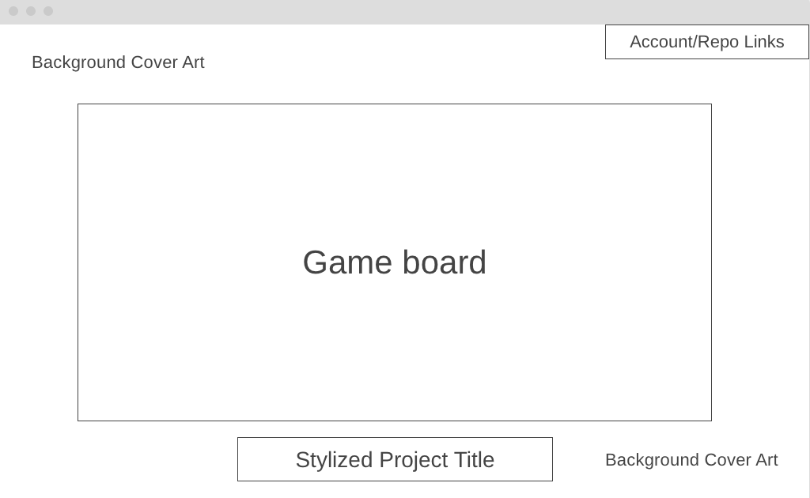

# outRun()

[outRun()](https://rjeriomenko.github.io/outRun/) is a top-down 2D action-idle videogame that runs in the browser using vanilla JavaScript and Canvas API. All menus accept both keyboard inputs and mouse input from the user. The user uses WASD or the arrow keys to control a player character and surive in an arena. The map is pre-loaded with obstacles, but enemies will be dynamically created and destroyed during gameplay. The game's camera follows the player's movements around the map. The player character gains experience points and chooses from a random selection of new abilities and upgrades when they collect enough experience points to level up. The player loses the game when they run out of health points. The player's score is determined by how long they survive on the map.

---

Functionality & MVPs
In outRun, users will be able to:

1. Navigate an arena with WASD and arrow keys.

```js
function() {
    return 1 + 1;
}
```
<!-- Incorporate an image of your code or a code snippet: -->
<!-- Incoporate either an image or gif of your game in action, displaying this feature. -->

2. Collide with other entities on the map via hitboxes.
3. Automatically attack nearby enemies with character abilities.
4. Lose health points upon colliding with enemies and gain experience points when enemies are defeated.
5. Choose from a random selection of character upgrades upon level up.


In addition, this project will include:

A dynamic and visually appealing main menu.
Toggleable music that is unique to each menu.
A pause menu with quit and restart functionality.
A README that gives context for users unfamiliar with the game.


---

Wireframe
https://wireframe.cc/icylla
 

---

Technologies, Libraries, APIs
The game renders in Canvas and its logic is handled by Node in the browser. It uses webpack to handle file dependencies.

---
Implementation Timeline
Friday Afternoon & Weekend
Allow for user keyboard input to move character. Create entity collision detection that prevents player movement. Set up basic background image for the map. Adjust canvas height and width if necessary. Switch from setInterval() to requestAnimationFrame() if necessary. Install babel and sass dependencies.

Monday
Create enemy class. Create enemy generation functionality. Give enemies basic AI to pursue player character. Allow enemies to damage player health. Create ability class. Allow player abilities to automatically damage enemies. Reward player with experience as enemies are defeated.

Tuesday
Create event class. Create levelUp event. Create more abilities that player can add to their player character on level-up. Create more enemy types. Tweak enemy count, health points, and number of environment objects to make game challenging.

Wednesday
Give player character and enemies sprites. Create mainMenu event. Give background an image that reflects environment collision boxes. Create pauseMenu event. Implement background music that is toggleable.

Thursday Morning
Deploy to GitHub pages and create production README.

---

This project is available exclusively for non-profit, educational purposes.

Music credits:

METAROOM - The Purge Event
Oliver Buckland - Dead God Graveyard
Macintosh Plus - Lisa Frank 420 / Modern Computing
Scattle - To the Top